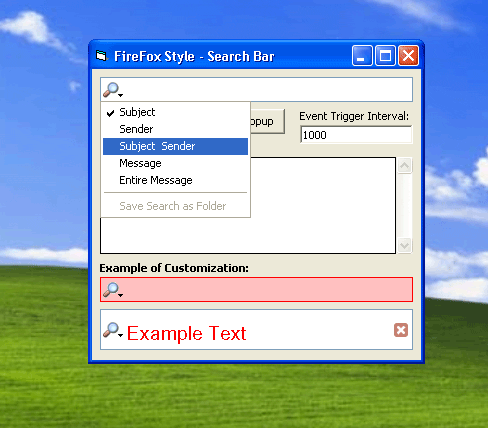



## FireFox Style SearchBox Control

### Description

FireFox Style SearchBox Control

----

The FireFox Style SearchBox Control is an ActiveX Control that allows developers to add a neat Search Box to their Applications. As shown in the screenshot below, the test application allows you to change a variety of the controls properties, such as Back/Fore/Border Color, Font Size/Style, Event Trigger Interval, etc.

Feature Overview:

&#8226;	Customisable Text Input Area,

&#8226;	Optional Popup Menu Support via Left Icon (Triggers Popup Event),

&#8226;	Customise Color and Font Settings,

&#8226;	Timed Search Trigger (Fires event if Search String has changed every X milliseconds instead of every key press)

&#8226;	Cancel Search Button
 
### More Info
 

             |
---                |---
**Submitted On**   |2005-11-07 01:00:02
**By**             |[Christiaan Nillissen](https://github.com/Planet-Source-Code/PSCIndex/blob/master/ByAuthor/christiaan-nillissen.md)
**Level**          |Intermediate
**User Rating**    |5.0 (10 globes from 2 users)
**Compatibility**  |VB 5\.0, VB 6\.0
**Category**       |[Custom Controls/ Forms/  Menus](https://github.com/Planet-Source-Code/PSCIndex/blob/master/ByCategory/custom-controls-forms-menus__1-4.md)
**World**          |[Visual Basic](https://github.com/Planet-Source-Code/PSCIndex/blob/master/ByWorld/visual-basic.md)
**Archive File**   |[FireFox\_St1946671172005\.zip](https://github.com/Planet-Source-Code/christiaan-nillissen-firefox-style-searchbox-control__1-63185/archive/master.zip)

